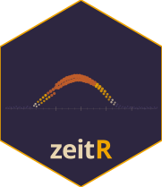

# ⌚️ zeitR 

**Actigraphy data parsing and analysis for R.**

[](https://circadia-bio.r-universe.dev/zeitR)
[](https://doi.org/10.5281/zenodo.21315925)
[](./LICENSE)
[](https://www.r-project.org/)
[](https://github.com/circadia-bio/zeitR/actions/workflows/R-CMD-check.yaml)
[](https://github.com/circadia-bio/zeitR/actions/workflows/pkgdown.yaml)
[](https://github.com/circadia-bio/zeitR)
[](https://zeitr.circadia-lab.uk)

---

> [!WARNING]
> **zeitR is in early development and has not been formally validated.** The CSPD pipeline has been validated epoch-for-epoch against the Condor circadiaBase Python reference on an ActTrust recording. The Vallim pipeline has been validated at the classification level against Julia Vallim's Python reference notebook. Neither pipeline has undergone formal peer review. Verify outputs independently before using in any research context.

---

## 📖 What is zeitR?

zeitR is an R package for importing, parsing, and analysing raw actigraphy recordings from wrist-worn devices. It runs a full rest-activity pipeline — off-wrist detection, sleep period identification, WASO computation — and computes standard non-parametric circadian rhythm variables (IS, IV, RA, L5, M10), returning tidy data frames ready for downstream chronobiological analysis.

zeitR ships two end-to-end pipelines:

- **`run_pipeline()`** — the Condor CSPD pipeline, validated epoch-for-epoch against the Condor circadiaBase Python reference.
- **`run_pipeline_native()`** — the **Vallim pipeline**, a post-processing layer developed by Julia Ribeiro da Silva Vallim that replaces Condor's classification logic with an adaptive 7-rule rule set (Fix 25, 26a/b/c, 27, 29, Rules 3–7). Handles edge cases including fragmented episodes, long sleep periods, date collisions, and adaptive nocturnal window inference from wrist temperature and ambient light.

zeitR is designed to complement [slumbR](https://github.com/circadia-bio/slumbR) in the Circadia Lab ecosystem: slumbR handles sleep diary and questionnaire data, zeitR handles the actigraphy side of a study.

Beyond the two pipelines, zeitR also estimates energy expenditure and classifies physical activity (PA) intensity from raw ActTrust/GT3X+ activity counts, using published equations (see `pa_equations()` in Features below) -- extending zeitR beyond sleep into the other half of the 24 h rest-activity cycle. `compute_activity_counts()` extends this one step further back: for devices or pipelines that only provide raw triaxial acceleration samples rather than onboard-computed counts, it converts them into the same epoch-level PIM/TAT/ZCM shape `read_acttrust()` already produces.

---

## ✨ Features

- 📥 **`read_actigraphy()`** — parse a raw device file into a `zeitr_recording` object
- 📂 **`read_actigraphy_dir()`** — batch-read a whole directory into a `zeitr_study`
- 🧾 **`read_acttrust()`** — parse a Condor ActTrust `.txt` export into a tidy tibble
- ⌚️ **`read_axivity()`** — bridge `axR`'s raw Axivity AX3/AX6 (`.cwa`) output into the same epoch-level shape, via `compute_activity_counts()`
- 🧼 **`prepare_actigraphy()`** — clamp temperature ranges and initialise `state`/`offwrist`/`sleep` columns
- 🔍 **`check_consistency()`** — flag timestamp gaps, backward jumps, and firmware artefacts
- 🦾 **`detect_offwrist_bimodal()`** — Condor bimodal activity/temperature off-wrist detection
- 😴 **`detect_sleep_crespo()`** — main sleep period detection (Crespo et al., 2012)
- 💤 **`detect_naps_crespo()`** — secondary sleep period detection (Crespo et al., 2012)
- ⏱️ **`score_epochs_cole_kripke()`** — epoch-level wake/sleep scoring (Cole & Kripke, 1992)
- 📊 **`compute_waso()`** — nightly TBT, TST, WASO, SOL, SOI, awakenings, sleep efficiency
- 📐 **`compute_npcra()`** — non-parametric circadian rhythm analysis (IS, IV, RA, L5, M10)
- 🌙 **`compute_sri()`** — Sleep Regularity Index (Phillips et al., 2017), from epoch-level sleep/wake state
- 🗂️ **`study_summary()`** — participant-level NPCRA summary across a whole study
- 🗂️ **`study_sleep_metrics()`** — participant-level sleep-timing/chronotype summary (CPD, MSF/MSW, SJL) across a whole study
- 📋 **`compute_sleep_metrics()`** — per-night sleep metrics split by day type (overall / workday / free day)
- 📋 **`compute_cpd_metrics()`** — CPD, MSW, MSF, MSFsc, social jet lag (SJL, SJLa)
- 🌞 **`compute_activity_counts()`** — convert raw triaxial acceleration into epoch-level PIM/TAT/ZCM counts (reuses `mrpheus`'s validated filter primitives)
- 📚 **`pa_equations()`** — published ActTrust/GT3X+ MET-estimation coefficients and count cut-points (Batista et al., 2026)
- 🔥 **`estimate_ee()`** — estimate METs from activity counts via the published regression equation
- 🏃 **`classify_pa_intensity()`** — bin METs into light/moderate/vigorous/very vigorous PA bands
- 🏃‍♀️ **`classify_pa_counts()`** — classify PA intensity directly from activity counts (device + placement)
- 🚀 **`run_pipeline()`** — full CSPD pipeline on a single file
- 🗃️ **`run_pipeline_batch()`** — CSPD pipeline across a directory
- 🌙 **`run_pipeline_native()`** — full Vallim pipeline on a single file
- 🌙 **`run_pipeline_native_batch()`** — Vallim pipeline across a directory
- 📈 **`plot_actogram()`** — single-column raster actogram of sleep/wake states
- 🌗 **`plot_actogram_double()`** — classic double-plotted actogram (48 h window per row)
- ⚡ **`plot_actogram_activity()`** — double-plotted actogram with activity-intensity bars
- 🎨 **`actogram_colours()`** — default state colour palette for actogram plots
- 📤 **`export_hypnogram()`** — export to `hypnoR` format (`W` / `Sleep` / `Quiet sleep`; `subject_id` auto-inferred)
- 🔬 **`extract_sleep_episodes()`** — extract per-episode statistics from a CSPD-scored table
- 🔬 **`classify_sleep_episodes()`** — apply the JRSV rule set to classify episodes
- 📏 **`circ_mean_h()`** — circular mean for clock-time variables (handles midnight wrap)
- 📏 **`circ_sd_h()`** — circular SD for clock-time variables
- 🏷️ **`label_states()`** — convert integer epoch states to a human-readable factor
- ⚙️ **`acttrust_params()`** — device parameter preset for the ActTrust actigraph

---

## 🚀 Getting Started

### Installation

Install from [r-universe](https://circadia-bio.r-universe.dev) (recommended — pre-built binaries):

```r
install.packages(
  "zeitR",
  repos = c("https://circadia-bio.r-universe.dev", "https://cloud.r-project.org")
)
```

Or install the development version from GitHub:

```r
install.packages("pak")
pak::pak("circadia-bio/zeitR")
```

### CSPD pipeline

```r
library(zeitR)

result <- run_pipeline("recordings/P001.txt", tz = "America/Sao_Paulo")

result$nights  # nightly sleep statistics
result$data    # epoch-level tibble with state column
result$issues  # timestamp consistency flags
```

### Vallim pipeline

```r
result <- run_pipeline_native("recordings/P001.txt", tz = "America/Sao_Paulo")

# nights has an additional sleep_type column ("main" / "secondary")
result$nights |> dplyr::filter(sleep_type == "main")
```

### State labels

```r
result$data$state_label <- label_states(result$data$state)

table(result$data$state_label)
#>      wake     sleep       nap off-wrist
#>     48231     24603       892      2470
```

### Circular statistics

```r
main_nights <- result$nights |> dplyr::filter(sleep_type == "main")
onset_h     <- as.numeric(format(main_nights$bed_time, "%H")) +
               as.numeric(format(main_nights$bed_time, "%M")) / 60

circ_mean_h(onset_h)  # mean sleep onset (handles midnight wrap)
circ_sd_h(onset_h)    # within-person variability in sleep onset
```

### Non-parametric circadian rhythm analysis

```r
rec   <- read_acttrust("recordings/P001.txt", tz = "America/Sao_Paulo")
npcra <- compute_npcra(rec)
npcra
#>   IS    IV    RA    L5 L5_onset   M10 M10_onset n_days
#>   0.72  0.43  0.89  12.3    02:30  84.7     11:00    7.0
```

### Sleep Regularity Index

```r
result <- run_pipeline_native("recordings/P001.txt", tz = "America/Sao_Paulo")
compute_sri(result)
#>   participant_id   sri n_pairs n_epochs
#>   P001             78.4    8640    10080
```

Derives sleep/wake from the epoch-level `state` column zeitR's own pipelines
already produce, rather than a pyActigraphy-style scoring algorithm -- see
`?compute_sri` for the off-wrist gap-interpolation rules and why this
approach showed substantially better agreement with manual reference
scoring in validation.

### Device configuration

```r
p <- acttrust_params()
p$sleep$sleep_quantile <- 1/3   # original Crespo (2012) threshold

result <- run_pipeline("recordings/P001.txt", params = p)
```

### Physical activity intensity

```r
result$data$pa_intensity <- classify_pa_counts(
  result$data$activity,
  device    = "ACTT",
  placement = "wrist"
)

table(result$data$pa_intensity)
```

See `vignette("physical-activity")` and `?pa_equations` before using this in
a real analysis -- the equations come from a single controlled-treadmill
validation study and the help page spells out exactly what that does and
doesn't license.

### Raw accelerometry -> PIM/TAT/ZCM

```r
# x, y, z: raw triaxial acceleration samples; sampling_rate in Hz
counts <- compute_activity_counts(x, y, z, sampling_rate = 25, epoch_sec = 60)
counts$mets         <- estimate_ee(counts$PIM, device = "ACTT", placement = "wrist")
counts$pa_intensity <- classify_pa_intensity(counts$mets)
```

Requires `mrpheus` (reuses its validated `remove_dc()`/`bandpass_filter()`
rather than a new, unvalidated filter). See `vignette("raw-accelerometry")`
and `?compute_activity_counts` for the full processing chain and what is
(and isn't) validated about it.

### Axivity AX3/AX6 (`.cwa`) files

```r
# Bridges axR::axivity_read_cwa()'s raw per-sample output into the same
# epoch-level shape read_acttrust() produces
rec <- read_axivity("recordings/P001.cwa", tz = "America/Sao_Paulo")
rec

# or via the device-agnostic wrapper
rec <- read_actigraphy("recordings/P001.cwa", device = "axivity", tz = "America/Sao_Paulo")
```

Requires `axR` (raw `.cwa` parsing). Treat `activity`/`ZCMn` from this path
as an unvalidated approximation -- no filter/threshold preset has been
checked against real Axivity output; see `?read_axivity` for the full
caveats.

---

## 📐 Computed variables

### NPCRA (`compute_npcra()`)

| Variable | Definition |
|---|---|
| `IS` | Interdaily stability — consistency of the 24 h rhythm across days (0–1) |
| `IV` | Intradaily variability — fragmentation of the rest-activity rhythm (≥ 0) |
| `RA` | Relative amplitude — contrast between M10 and L5 (0–1) |
| `L5` / `L5_onset` | Mean activity and onset of the least active 5 h window |
| `M10` / `M10_onset` | Mean activity and onset of the most active 10 h window |

### Sleep Regularity Index (`compute_sri()`)

| Variable | Definition |
|---|---|
| `sri` | Sleep Regularity Index (Phillips et al., 2017) — day-to-day sleep/wake consistency; −100 (inverted) to +100 (perfectly regular), 0 = chance |
| `n_pairs` | Number of valid 24h-apart epoch comparisons used |

### Nightly sleep statistics

| Variable | Definition |
|---|---|
| `tbt` | Total Bed Time (minutes) |
| `tst` | Total Sleep Time (minutes) |
| `waso` | Wake After Sleep Onset (minutes) |
| `sol` | Sleep Onset Latency (minutes) |
| `soi` | Sleep Offset Inertia (minutes) |
| `nw` | Number of awakenings |
| `eff` | Sleep efficiency — TST / TBT |
| `sleep_type` | `"main"` or `"secondary"` (Vallim pipeline only) |

### Physical activity intensity (`classify_pa_intensity()` / `classify_pa_counts()`)

| Band | MET range |
|---|---|
| `light` | [0, 3) |
| `moderate` | [3, 6) |
| `vigorous` | [6, 9) |
| `very_vigorous` | [9, ∞) |

Published coefficients and count-based cut-points for ActTrust/GT3X+, hip/wrist, are in `pa_equations()` -- see `?pa_equations` for important generalisability caveats before applying these outside the source study's population (single lab-treadmill validation, N=56, healthy adults 18-35).

---

## 🔬 Algorithms

| Step | Algorithm | Reference | Validated |
|---|---|---|---|
| Off-wrist detection | Condor bimodal activity/temperature model | Condor Instruments | ActTrust ✓ |
| Sleep period detection | Crespo adaptive median filter | Crespo et al. (2012) | ActTrust ✓ |
| Nap detection | Crespo zero-proportion filter | Crespo et al. (2012) | ActTrust ✓ |
| Epoch scoring | Cole-Kripke weighted ZCM sum | Cole & Kripke (1992) | ActTrust ✓ |
| Episode classification | Vallim JRSV rule set (Fixes 25, 26a/b/c, 27, 29) | Vallim (2024) | ActTrust ✓ |
| Sleep summary | Day-type metric split (overall / workday / free day) | Vallim (2024) | ActTrust ✓ |
| Chronotype | CPD, MSW, MSF, MSFsc, SJL | Roenneberg et al. | ActTrust ✓ |

The CSPD pipeline has been validated epoch-for-epoch (0 / 76,196 mismatches) against the Condor circadiaBase Python reference. The Vallim pipeline has been validated at the classification level: all 52 main nights on the ActTrust validation recording classified identically to Julia Vallim's Python reference notebook. R is now the reference implementation for Fix 26c (fragment recovery), which correctly uses Cole-Kripke epoch scoring and proper temperature/light column names that were mismatched in the Python original.

---

## 🗂️ Project Structure

```
zeitR/
├── R/
│   ├── zeitR-package.R       # package-level docs and Rcpp registration
│   ├── read_acttrust.R       # ActTrust file parser
│   ├── read_axivity.R        # Axivity .cwa bridge (via axR + compute_activity_counts())
│   ├── read_actigraphy.R     # device-agnostic wrapper, zeitr_study
│   ├── prepare.R             # temperature clamping, state column init
│   ├── consistency.R         # timestamp quality checks
│   ├── offwrist.R            # detect_offwrist_bimodal()
│   ├── offwrist_refiner.R    # three-stage BimodalOffwristRefiner port
│   ├── sleep_periods.R       # detect_sleep_crespo(), detect_naps_crespo()
│   ├── sleep_classify.R      # Vallim pipeline: extract + classify episodes
│   ├── sleep_metrics.R       # compute_sleep_metrics(), compute_cpd_metrics()
│   ├── cole_kripke.R         # score_epochs_cole_kripke()
│   ├── waso.R                # compute_waso()
│   ├── npcra.R               # compute_npcra()
│   ├── sri.R                 # compute_sri()
│   ├── study_summary.R       # study_summary()
│   ├── study_sleep_metrics.R # study_sleep_metrics()
│   ├── pa_intensity.R        # pa_equations(), estimate_ee(), classify_pa_intensity/counts()
│   ├── raw_accelerometry.R   # compute_activity_counts()
│   ├── plot_actogram.R       # plot_actogram*(), actogram_colours()
│   ├── circ_utils.R          # circ_mean_h(), circ_sd_h()
│   ├── params.R              # acttrust_params()
│   ├── pipeline.R            # run_pipeline*(), run_pipeline_native*()
│   ├── export.R              # export_hypnogram()
│   └── utils.R               # label_states() + Rcpp wrappers + helpers
├── src/
│   └── rolling_filters.cpp   # Rcpp: rolling filters, diff5, Cole-Kripke
├── man/figures/
│   ├── logo.svg
│   └── favicon.svg
├── vignettes/
│   ├── getting-started.Rmd
│   ├── npcra.Rmd
│   ├── study-analysis.Rmd
│   ├── actogram.Rmd          # actogram plotting walkthrough
│   ├── sleep-analysis.Rmd    # CSPD pipeline walkthrough
│   ├── vallim-pipeline.Rmd   # Vallim pipeline walkthrough
│   ├── holidays.Rmd          # classifying weekends/public holidays
│   ├── physical-activity.Rmd # PA intensity from ActTrust/GT3X+ counts
│   └── raw-accelerometry.Rmd # PIM/TAT/ZCM from raw triaxial acceleration
├── tests/testthat/
├── inst/extdata/             # validation fixtures
├── DESCRIPTION
├── NEWS.md
└── zeitR.Rproj
```

---

## 📦 Dependencies

| Package | Type | Purpose |
|---|---|---|
| cli | Imports | Messages and progress |
| lubridate | Imports | Date/time handling |
| mclust | Imports | Bimodal GMM for off-wrist detection |
| Rcpp | Imports | C++ rolling filters and epoch scoring |
| tibble | Imports | Tidy data frames |
| tidyr | Imports | Pivoting and reshaping |
| ggplot2 | Suggests | Actogram and PA-intensity plots — checked at runtime, not required for non-plotting functions |
| dplyr, forcats, rlang | Suggests | Used in vignettes and some helper functions |
| mrpheus | Suggests | Filter primitives (`remove_dc()`, `bandpass_filter()`) reused by `compute_activity_counts()`; cross-package dependency from the circadia-bio r-universe, not CRAN |
| axR | Suggests | Raw `.cwa`/AX6 file parsing (`axivity_read_cwa()`) reused by `read_axivity()`; cross-package dependency from the circadia-bio r-universe, not CRAN |
| future, future.apply | Suggests | Parallel batch processing (`run_pipeline_batch()`, `run_pipeline_native_batch()`) |
| vdiffr | Suggests | Visual regression tests for actogram plots |
| testthat, covr | Suggests | Test suite and coverage |
| withr | Suggests | Test-only: temporary files/mocked bindings cleanup in `test-read-axivity.R` |
| knitr, rmarkdown, pkgdown | Suggests | Vignettes and documentation site |

---

## 👥 Authors

| Role | Name | Affiliation |
|---|---|---|
| Author, maintainer | Lucas França | Northumbria University, Circadia Lab |
| Author | Mario Leocadio-Miguel | Northumbria University, Circadia Lab |
| Author | Julia Ribeiro da Silva Vallim | Universidade Federal de São Paulo |

---

## 📄 Citation

If you use zeitR in your research, please cite it:

```bibtex
@software{franca_zeitr_2026,
  author  = {França, Lucas and Leocadio-Miguel, Mario and Vallim, Julia Ribeiro da Silva},
  title   = {{zeitR}: Actigraphy Data Parsing and Analysis for R},
  year    = {2026},
  version = {0.1.6},
  doi     = {10.5281/zenodo.21315925},
  url     = {https://github.com/circadia-bio/zeitR}
}
```

---

## 🤝 Related Tools

- 🛌 [**slumbR**](https://github.com/circadia-bio/slumbR) — sleep diary processing and circadian metrics
- 🧮 [**tallieR**](https://github.com/circadia-bio/tallieR) — sociodemographic and questionnaire scoring
- 🔄 [**syncR**](https://github.com/circadia-bio/syncR) — unified participant-indexed database for the Circadia ecosystem
- 🔬 [**circadia-bio**](https://github.com/circadia-bio) — the Circadia Lab GitHub organisation

---

## 📄 Licence

Released under the [MIT License](./LICENSE).

Copyright © Lucas França, Mario Leocadio-Miguel, 2026
