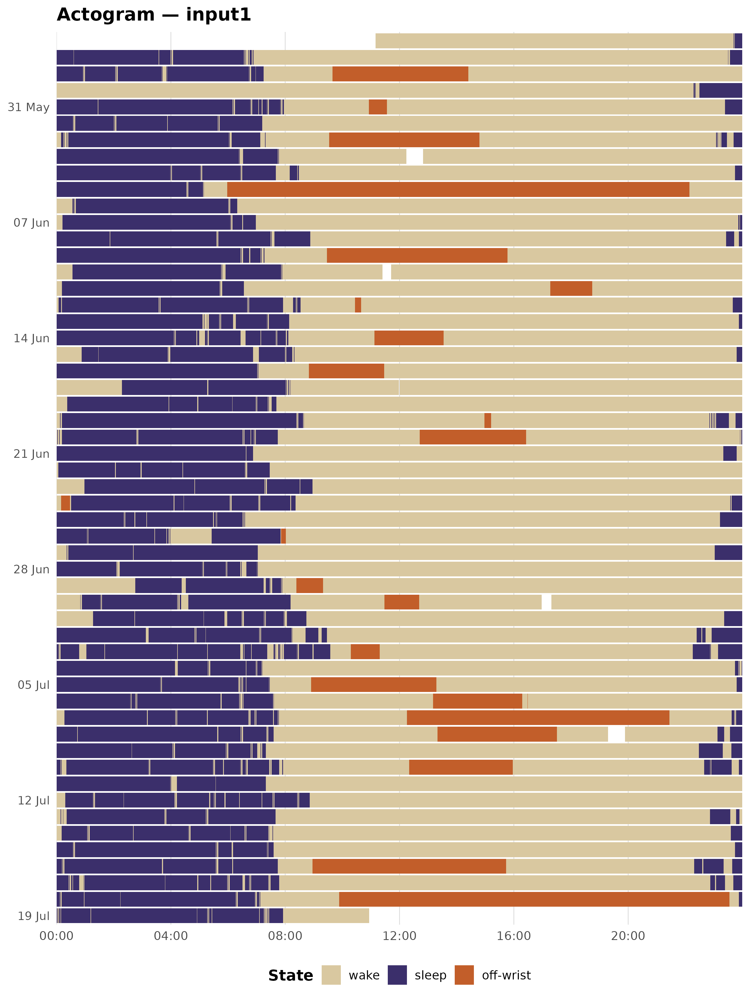
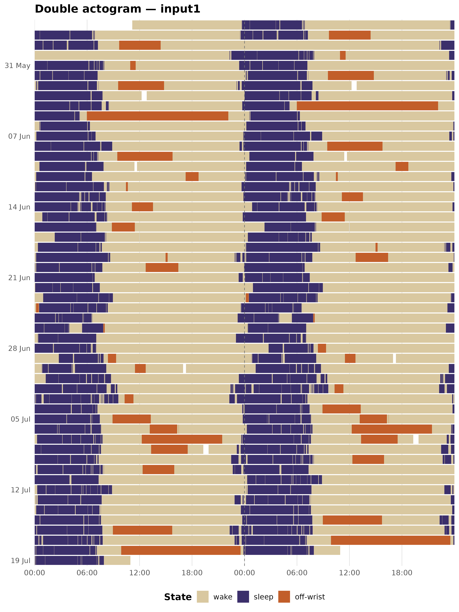
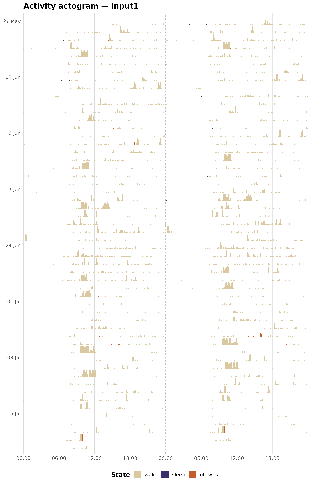
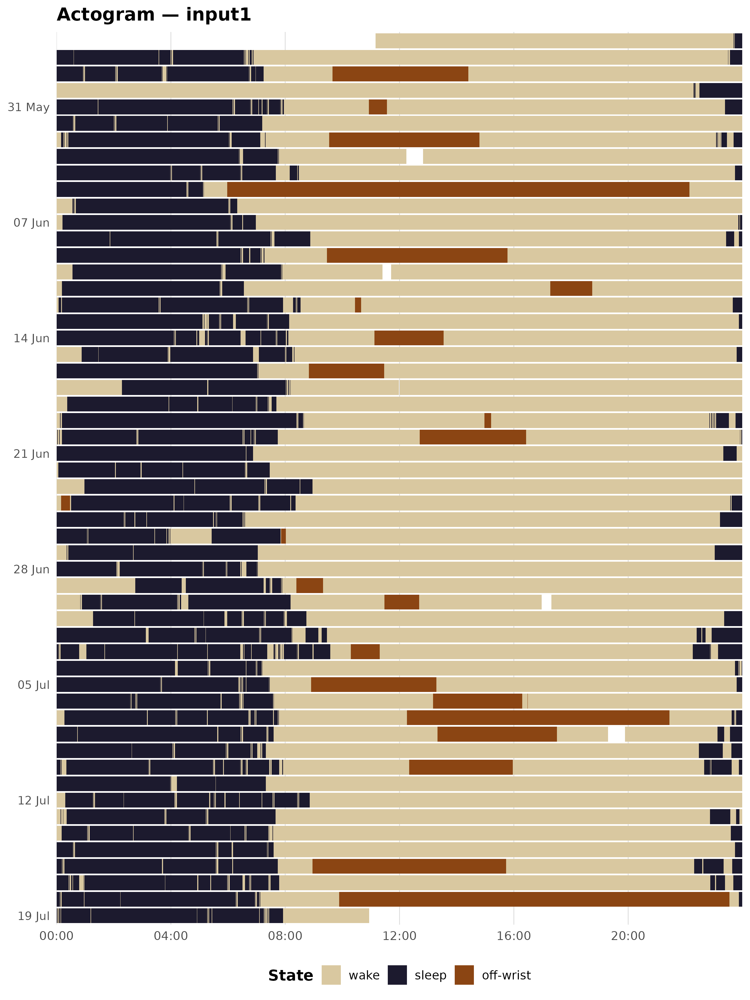
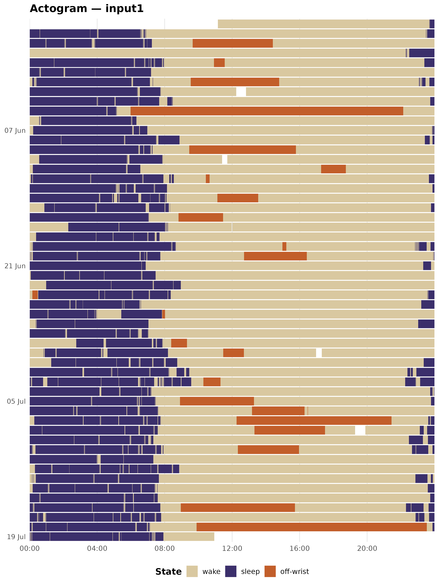
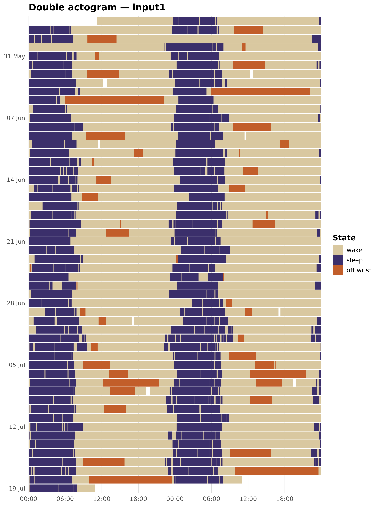
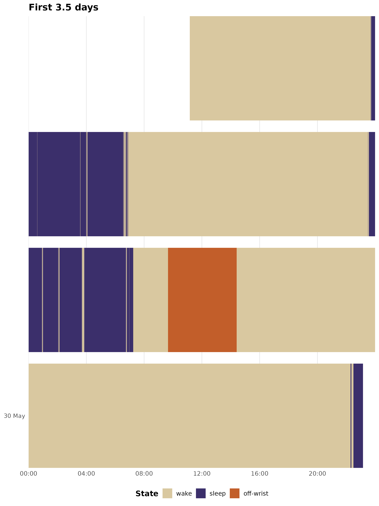

# Actogram visualisation

An actogram is the standard visualisation for wrist actigraphy data. It
lays out the full epoch-level state sequence as a raster – one row per
calendar day, time of day on the x-axis – so that a recording spanning
weeks can be read at a glance. zeitR provides three actogram variants:

| Function | Format | Best for |
|----|----|----|
| [`plot_actogram()`](https://zeitr.circadia-lab.uk/reference/plot_actogram.md) | Single column, 24 h | Overview, presentations |
| [`plot_actogram_double()`](https://zeitr.circadia-lab.uk/reference/plot_actogram_double.md) | Double-plotted, 48 h | Phase drift, phase assessment |
| [`plot_actogram_activity()`](https://zeitr.circadia-lab.uk/reference/plot_actogram_activity.md) | Double-plotted + activity bars | Intensity + state simultaneously |

All three accept either a `zeitr_result` list from the pipeline or a
bare tibble with `datetime` and `state` columns.

------------------------------------------------------------------------

## Setup

The examples below use the ActTrust validation recording bundled with
zeitR, run through
[`run_pipeline_native()`](https://zeitr.circadia-lab.uk/reference/run_pipeline_native.md).

``` r

FILE <- system.file("extdata", "input1.txt", package = "zeitR")
TZ   <- "America/Sao_Paulo"

result <- run_pipeline_native(FILE, tz = TZ, quiet = TRUE)
#> ℹ Reading input1.txt ...
#> ✔ [input1] Done. 52 main night(s), 0 secondary episode(s).
```

------------------------------------------------------------------------

## Single-column actogram

[`plot_actogram()`](https://zeitr.circadia-lab.uk/reference/plot_actogram.md)
draws one row per calendar day with time of day (00:00 to 24:00) on the
x-axis. The oldest day is at the top, following standard chronobiology
convention. Rows are labelled every seven days by default.

``` r

plot_actogram(result, tz = TZ)
#> Warning: Removed 53 rows containing missing values or values outside the scale range
#> (`geom_tile()`).
```



The dark purple band running through the centre of each row is the main
sleep period. The amber gaps are naps; the terracotta blocks are
off-wrist episodes.

------------------------------------------------------------------------

## Double-plotted actogram

[`plot_actogram_double()`](https://zeitr.circadia-lab.uk/reference/plot_actogram_double.md)
uses the classic double-plot format from chronobiology: each recording
day appears **twice** – in the left column of its own row (x = 00:00 to
24:00) and in the right column of the row above (x = 24:00 to 48:00). A
dashed vertical line marks the 24 h boundary.

When the sleep band drifts diagonally across rows, that drift reflects
day-to-day changes in circadian phase. A stable schedule appears as a
straight vertical band; a free-running rhythm traces a slanted line.

``` r

plot_actogram_double(result, tz = TZ)
#> Warning: Removed 53 rows containing missing values or values outside the scale range
#> (`geom_tile()`).
```



------------------------------------------------------------------------

## Activity double-plotted actogram

[`plot_actogram_activity()`](https://zeitr.circadia-lab.uk/reference/plot_actogram_activity.md)
keeps the double-plot layout but replaces filled tiles with vertical
bars. Each bar’s height is proportional to the raw ZCMn activity count;
bars are coloured by sleep/wake state. This lets you read both the
intensity of activity and the state classification from a single plot.

Bar heights are capped at the 99th percentile of non-zero epochs by
default (`activity_cap_quantile = 0.99`), so a handful of outlier bursts
do not compress the rest of the range. Zero-activity epochs (sleep,
off-wrist) receive a thin 2% baseline stub so they remain faintly
visible rather than disappearing entirely.

``` r

plot_actogram_activity(result, tz = TZ)
```



------------------------------------------------------------------------

## Colour customisation

### Inspecting the default palette

[`actogram_colours()`](https://zeitr.circadia-lab.uk/reference/actogram_colours.md)
returns the named hex vector used as the default palette across all
three functions. Printing it is the quickest way to see the current
defaults before overriding them.

``` r

actogram_colours()
#>      wake     sleep       nap off-wrist 
#> "#D9C8A0" "#3B2F6B" "#F0A500" "#C25E2A"
```

### Overriding individual colours

Pass a named character vector to the `colours` argument. You only need
to supply the states you want to change; unnamed states keep the
default.

``` r

my_cols <- actogram_colours()
my_cols["sleep"]     <- "#1C1A2E"   # darker midnight
my_cols["off-wrist"] <- "#8B4513"   # saddle brown

plot_actogram(result, tz = TZ, colours = my_cols)
#> Warning: Removed 53 rows containing missing values or values outside the scale range
#> (`geom_tile()`).
```



### Suppressing naps

If your recording has no naps, or you want to simplify the legend, you
can drop the nap level by providing only three colours:

``` r

plot_actogram(result, tz = TZ,
              colours = c(wake = "#D9C8A0", sleep = "#3B2F6B",
                          "off-wrist" = "#C25E2A"))
```

------------------------------------------------------------------------

## Date labels and font size

`date_label_every` controls how many rows share a single y-axis tick.
The default is `7` (one tick per week). Reduce it for shorter recordings
or increase it for very long ones.

``` r

# Label every 14 days
plot_actogram(result, tz = TZ, date_label_every = 14L)
#> Warning: Removed 53 rows containing missing values or values outside the scale range
#> (`geom_tile()`).
```



`base_size` sets the base font size passed to `theme_minimal()`:

``` r

plot_actogram(result, tz = TZ, base_size = 11)   # smaller text
plot_actogram(result, tz = TZ, base_size = 16)   # larger text (presentations)
```

------------------------------------------------------------------------

## Adding ggplot2 layers

All three functions return a standard `ggplot` object, so you can extend
them with any ggplot2 layer or theme override:

``` r

plot_actogram_double(result, tz = TZ) +
  theme(legend.position = "right")
#> Warning: Removed 53 rows containing missing values or values outside the scale range
#> (`geom_tile()`).
```



------------------------------------------------------------------------

## Working with a bare tibble

The functions accept any tibble with `datetime` (POSIXct) and `state`
(integer) columns – no pipeline required. This is useful if you have
data in a format other than a `zeitr_result`.

``` r

# Subset a few weeks from result$data and plot directly
sub <- result$data[1:5040, ]   # first 3.5 days for illustration
plot_actogram(sub, tz = TZ, title = "First 3.5 days")
#> Warning: Removed 3 rows containing missing values or values outside the scale range
#> (`geom_tile()`).
```



The `state` column should use zeitR’s integer coding:
`0 = wake, 1 = sleep, 4 = off-wrist, 7 = nap`.

------------------------------------------------------------------------

## Choosing between the three variants

- Use
  [`plot_actogram()`](https://zeitr.circadia-lab.uk/reference/plot_actogram.md)
  when you want a compact overview – one row per day, simple state
  raster. Good for reports and presentations.

- Use
  [`plot_actogram_double()`](https://zeitr.circadia-lab.uk/reference/plot_actogram_double.md)
  when you want to assess **circadian phase drift** across the
  recording. The 48 h window makes diagonal drift in the sleep band
  visible at a glance.

- Use
  [`plot_actogram_activity()`](https://zeitr.circadia-lab.uk/reference/plot_actogram_activity.md)
  when activity intensity matters – for example, when comparing
  sedentary and active participants, or checking whether an unexpectedly
  short TST reflects genuine low activity or a classification artefact.

------------------------------------------------------------------------

## Next steps

- [`vignette("sleep-analysis")`](https://zeitr.circadia-lab.uk/articles/sleep-analysis.md)
  – CSPD pipeline walkthrough
- [`vignette("vallim-pipeline")`](https://zeitr.circadia-lab.uk/articles/vallim-pipeline.md)
  – Vallim classification rule set
- [`?compute_sleep_metrics`](https://zeitr.circadia-lab.uk/reference/compute_sleep_metrics.md),
  [`?compute_cpd_metrics`](https://zeitr.circadia-lab.uk/reference/compute_cpd_metrics.md)
  – day-type sleep summary and chronotype metrics
- [`?export_hypnogram`](https://zeitr.circadia-lab.uk/reference/export_hypnogram.md)
  – export epoch-level staging to hypnoR
- [`?label_states`](https://zeitr.circadia-lab.uk/reference/label_states.md)
  – convert integer state codes to a human-readable factor
