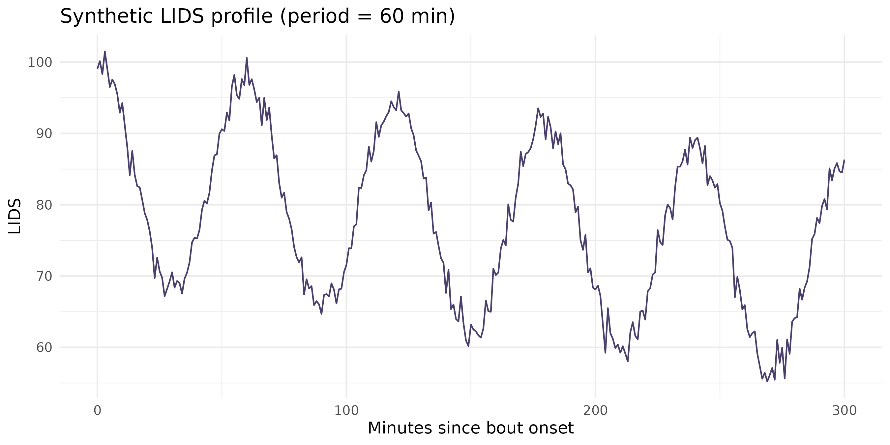
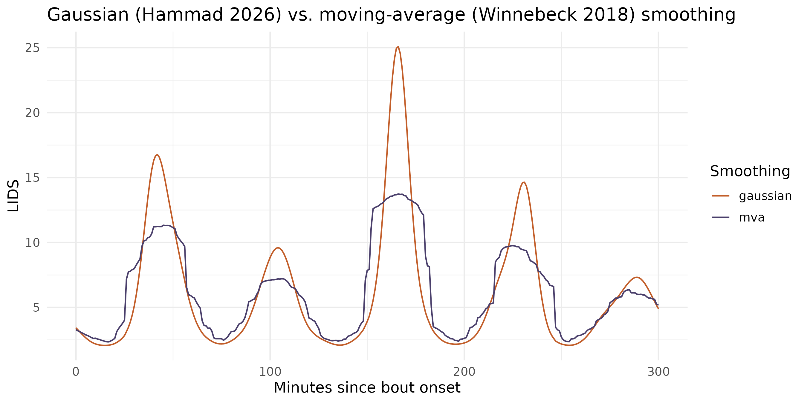

# LIDS: ultradian sleep-cycle dynamics from actigraphy

Sleep isn’t uniform from lights-out to wake-up: limb movement during
sleep rises and falls in ~60-110 minute cycles that track the
alternation between REM and non-REM sleep. Locomotor Inactivity During
Sleep (LIDS) is a way to recover that ultradian structure from ordinary
wrist/ankle actigraphy, without polysomnography – turning raw movement
counts into an “inactivity” signal, then fitting a cosine to it to
estimate cycle length, amplitude, and how inactivity trends over the
course of the night.

zeitR’s LIDS module ports two papers:

- **Winnebeck, Fischer, Leise & Roenneberg (2018)**, *Current Biology* –
  the original method (adults/adolescents): the `100/(1+x)` transform,
  moving-average smoothing, a plain cosine fit, and the Munich
  Rhythmicity Index (MRI) for period selection.
- **Hammad, Schoch, Engelmann, Spock, Kurth & Winnebeck (2026)**,
  *SLEEP* – an infant-tuned extension: Gaussian smoothing, a *sloped*
  cosine (adding a linear trend term to capture the well-documented
  overnight decline in inactivity), and a period scan tuned for shorter
  (~60 min) cycles.

**This module has not yet been validated against `pyActigraphy`’s `LIDS`
class or an external reference dataset** – see
[`?compute_lids`](https://zeitr.circadia-lab.uk/reference/compute_lids.md)
and [`?fit_lids`](https://zeitr.circadia-lab.uk/reference/fit_lids.md)
for exactly what’s ported from which paper, and treat results as
exploratory until a parity check is run.

------------------------------------------------------------------------

## The pipeline in one call: `compute_lids()`

For a `zeitr_result` from
[`run_pipeline()`](https://zeitr.circadia-lab.uk/reference/run_pipeline.md)
or
[`run_pipeline_native()`](https://zeitr.circadia-lab.uk/reference/run_pipeline_native.md),
[`compute_lids()`](https://zeitr.circadia-lab.uk/reference/compute_lids.md)
does everything: extracts sleep bouts, transforms and fits each one, and
returns a tibble with one row per bout.

``` r

FILE <- system.file("extdata", "input1.txt", package = "zeitR")
TZ   <- "America/Sao_Paulo"

result <- run_pipeline_native(FILE, tz = TZ, quiet = TRUE)
#> ℹ Reading input1.txt ...
#> ✔ [input1] Done. 52 main night(s), 0 secondary episode(s).

lids_bouts <- compute_lids(result, duration_range = c(3, 12))
lids_bouts
#> # A tibble: 36 × 14
#>    participant_id bout_id bout_start          bout_end            duration_h
#>    <chr>            <int> <dttm>              <dttm>                   <dbl>
#>  1 input1               1 2021-05-31 01:28:15 2021-05-31 06:09:15       4.68
#>  2 input1               2 2021-06-02 00:25:15 2021-06-02 06:01:15       5.6 
#>  3 input1               3 2021-06-02 23:42:15 2021-06-03 06:22:15       6.67
#>  4 input1               4 2021-06-04 00:01:54 2021-06-04 03:58:54       3.95
#>  5 input1               5 2021-06-04 23:45:54 2021-06-05 04:32:54       4.78
#>  6 input1               6 2021-06-06 00:41:54 2021-06-06 06:00:54       5.32
#>  7 input1               7 2021-06-07 00:13:54 2021-06-07 06:04:54       5.85
#>  8 input1               8 2021-06-08 01:53:54 2021-06-08 05:35:54       3.7 
#>  9 input1               9 2021-06-08 23:53:54 2021-06-09 06:26:54       6.55
#> 10 input1              10 2021-06-10 00:34:54 2021-06-10 05:45:54       5.18
#> # ℹ 26 more rows
#> # ℹ 9 more variables: period_min <dbl>, amplitude <dbl>, offset <dbl>,
#> #   slope_per_60min <dbl>, phase_rad <dbl>, pearson_r <dbl>, p_value <dbl>,
#> #   mri <dbl>, passes_quality_filter <lgl>
```

Each row is one detected sleep bout (`state == 1` runs from the pipeline
output, by default – see [Where bouts come from](#where-bouts-come-from)
below), with:

| Column | Meaning |
|----|----|
| `period_min` | Estimated ultradian cycle length (minutes) |
| `amplitude` | Oscillation amplitude (LIDS units) |
| `offset` | Inactivity level at bout start |
| `slope_per_60min` | Linear trend in inactivity across the bout |
| `phase_rad` | Phase at bout start (`0` = LIDS peak at onset) |
| `pearson_r`, `p_value`, `mri` | Fit quality and the Munich Rhythmicity Index |
| `passes_quality_filter` | `TRUE` if the bout clears the Winnebeck/Hammad quality bar |

``` r

mean(lids_bouts$passes_quality_filter)
#> [1] 1
summary(lids_bouts$period_min[lids_bouts$passes_quality_filter])
#>    Min. 1st Qu.  Median    Mean 3rd Qu.    Max. 
#>   36.00   51.50  101.00   98.94  123.50  180.00
```

------------------------------------------------------------------------

## Under the hood: a clean synthetic example

Because a real recording’s LIDS fit is noisy, it helps to see the method
on a signal built to have a known answer first: a 60-minute sloped
cosine with a little noise, the kind of ultradian cycle Hammad et
al. (2026) report in infants.

``` r

set.seed(1)
t    <- seq(0, 300, by = 1)                                 # 5 h, 1-min epochs
true_period <- 60
lids_clean  <- 85 + 15 * cos(2 * pi * t / true_period) -
  0.05 * t + rnorm(length(t), sd = 1.5)

if (has_ggplot2) {
  ggplot(data.frame(t = t, lids = lids_clean), aes(t, lids)) +
    geom_line(colour = "#4A3F6B") +
    labs(x = "Minutes since bout onset", y = "LIDS",
         title = "Synthetic LIDS profile (period = 60 min)") +
    theme_minimal(base_size = 12)
}
```



[`fit_lids()`](https://zeitr.circadia-lab.uk/reference/fit_lids.md)
recovers the period, amplitude, and slope directly from this profile:

``` r

fit <- fit_lids(lids_clean, period_range = c(30, 120), period_step = 1)
fit[c("period_min", "amplitude", "offset", "slope_per_60min", "pearson_r", "mri")]
#> $period_min
#> [1] 60
#> 
#> $amplitude
#> [1] 15.13642
#> 
#> $offset
#> [1] 85.12597
#> 
#> $slope_per_60min
#> [1] -3.028703
#> 
#> $pearson_r
#> [1] 0.9923784
#> 
#> $mri
#> [1] 30.0421
```

### From activity to LIDS: `lids_transform()`

In practice you start from raw activity counts, not a pre-built LIDS
profile.
[`lids_transform()`](https://zeitr.circadia-lab.uk/reference/lids_transform.md)
applies the `100/(1+x)` non-linear transform and smooths the result –
higher activity means lower inactivity, and smoothing suppresses
epoch-to-epoch noise so the underlying oscillation is fittable.

``` r

set.seed(2)
activity <- pmax(0, 30 + 20 * sin(2 * pi * t / true_period) + rnorm(length(t), sd = 8))

lids_gaussian <- lids_transform(activity, method = "gaussian")   # Hammad et al. 2026
lids_mva      <- lids_transform(activity, method = "mva")        # Winnebeck et al. 2018

if (has_ggplot2) {
  df <- data.frame(
    t = rep(t, 2),
    lids = c(lids_gaussian, lids_mva),
    method = rep(c("gaussian", "mva"), each = length(t))
  )
  ggplot(df, aes(t, lids, colour = method)) +
    geom_line() +
    scale_colour_manual(values = c(gaussian = "#C25E2A", mva = "#4A3F6B")) +
    labs(x = "Minutes since bout onset", y = "LIDS", colour = "Smoothing",
         title = "Gaussian (Hammad 2026) vs. moving-average (Winnebeck 2018) smoothing") +
    theme_minimal(base_size = 12)
}
```



Both methods track the same underlying oscillation; Gaussian smoothing
(the default) is slightly less aggressive at suppressing sharp
transients, which matters more for the shorter cycles and higher
amplitudes seen in infants than for adults.

------------------------------------------------------------------------

## Where bouts come from

[`compute_lids()`](https://zeitr.circadia-lab.uk/reference/compute_lids.md)’s
`bout_source` argument controls how sleep bouts are identified:

- **`"state"`** (used automatically above, since `result$data` already
  has a `state` column) – contiguous `state == 1` runs from an existing
  zeitR pipeline result. This is almost always what you want if you’ve
  already run
  [`run_pipeline()`](https://zeitr.circadia-lab.uk/reference/run_pipeline.md)
  or
  [`run_pipeline_native()`](https://zeitr.circadia-lab.uk/reference/run_pipeline_native.md).
- **`"roenneberg"`** – ignores any `state` column and runs the
  standalone
  [`detect_lids_bouts()`](https://zeitr.circadia-lab.uk/reference/detect_lids_bouts.md)
  relative- immobility detector directly on raw activity, reproducing
  Winnebeck/Hammad’s own bout-detection method rather than zeitR’s
  Crespo/Vallim pipelines. Use this for activity data you haven’t run
  through either pipeline.
- **`"auto"`** (the default) picks `"state"` if available,
  `"roenneberg"` otherwise.

``` r

bouts <- detect_lids_bouts(
  result$data$datetime, result$data$activity,
  duration_range = c(3, 12)
)
nrow(bouts)
#> [1] 39
head(bouts)
#> # A tibble: 6 × 5
#>   bout_id bout_start          bout_end            duration_h n_epochs
#>     <int> <dttm>              <dttm>                   <dbl>    <int>
#> 1       1 2021-05-27 23:40:15 2021-05-28 07:03:15       7.38      444
#> 2       2 2021-05-28 23:28:15 2021-05-29 07:30:15       8.03      483
#> 3       3 2021-05-30 22:17:15 2021-05-31 08:03:15       9.77      587
#> 4       4 2021-05-31 23:24:15 2021-06-01 07:10:15       7.77      467
#> 5       5 2021-06-02 23:36:15 2021-06-03 07:49:15       8.22      494
#> 6       6 2021-06-03 22:43:54 2021-06-04 07:46:54       9.05      538
```

------------------------------------------------------------------------

## Quality filtering

Not every bout yields a clean ultradian fit – a device removed
mid-sleep, an unusually short or fragmented bout, or genuine absence of
rhythmicity can all produce a poor fit.
[`compute_lids()`](https://zeitr.circadia-lab.uk/reference/compute_lids.md)
flags (rather than silently drops) bouts failing the Winnebeck/Hammad
quality bar:

``` r

table(lids_bouts$passes_quality_filter)
#> 
#> TRUE 
#>   36

lids_bouts[!lids_bouts$passes_quality_filter,
           c("bout_id", "duration_h", "pearson_r", "p_value", "offset")]
#> # A tibble: 0 × 5
#> # ℹ 5 variables: bout_id <int>, duration_h <dbl>, pearson_r <dbl>,
#> #   p_value <dbl>, offset <dbl>
```

Adjust the thresholds directly if the defaults (`min_r = 0.4`,
`max_p = 0.05`, `offset_bounds = c(1, 99)`) don’t suit your data:

``` r

compute_lids(result, min_r = 0.3, max_p = 0.1)
```

------------------------------------------------------------------------

## Study-level summaries

For a whole cohort,
[`study_lids_metrics()`](https://zeitr.circadia-lab.uk/reference/study_lids_metrics.md)
reduces each participant’s quality-filtered bouts to one row – median
and IQR period, amplitude, offset, and slope – ready for `syncR::sync()`
the same way
[`study_sleep_metrics()`](https://zeitr.circadia-lab.uk/reference/study_sleep_metrics.md)
and
[`study_summary()`](https://zeitr.circadia-lab.uk/reference/study_summary.md)
already are.

``` r

results <- run_pipeline_native_batch("recordings/", tz = "America/Sao_Paulo")
study_lids_metrics(results, min_bouts = 3)
```

------------------------------------------------------------------------

## Next steps

- [`?compute_lids`](https://zeitr.circadia-lab.uk/reference/compute_lids.md)
  – full argument reference, `bout_source` details, and the
  quality-filter rationale
- [`?fit_lids`](https://zeitr.circadia-lab.uk/reference/fit_lids.md),
  [`?lids_transform`](https://zeitr.circadia-lab.uk/reference/lids_transform.md)
  – the underlying cosine fit and smoothing, if you need to build a
  custom pipeline around them
- [`?detect_lids_bouts`](https://zeitr.circadia-lab.uk/reference/detect_lids_bouts.md)
  – the standalone bout detector, including what differs from the
  Winnebeck/Hammad notebook it was ported from
- Winnebeck et al. (2018), *Current Biology* 28(1), 49-59.e5,
  <https://doi.org/10.1016/j.cub.2017.11.063>
- Hammad et al. (2026), *SLEEP* – infant ultradian cycle lengthening,
  <https://zenodo.org/records/18199381>
