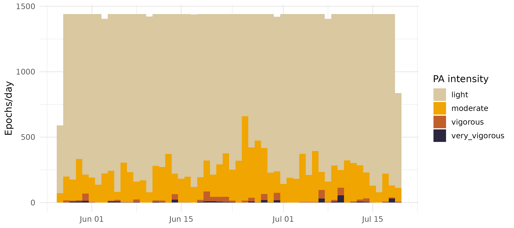

# Physical activity intensity from ActTrust/GT3X+ counts

zeitR’s pipeline so far has been about one half of the 24 h
rest-activity cycle: sleep.
[`pa_equations()`](https://zeitr.circadia-lab.uk/reference/pa_equations.md),
[`estimate_ee()`](https://zeitr.circadia-lab.uk/reference/estimate_ee.md),
[`classify_pa_intensity()`](https://zeitr.circadia-lab.uk/reference/classify_pa_intensity.md),
and
[`classify_pa_counts()`](https://zeitr.circadia-lab.uk/reference/classify_pa_counts.md)
add the other half – estimating energy expenditure (METs) and
classifying physical activity (PA) intensity from the same raw activity
counts, using equations published in Batista et al. (2026, *PLoS ONE*,
[doi.org/10.1371/journal.pone.0348631](https://doi.org/10.1371/journal.pone.0348631)).

**Read
[`?pa_equations`](https://zeitr.circadia-lab.uk/reference/pa_equations.md)
before using this in a real analysis.** These equations come from a
single controlled-treadmill validation study, and the help page spells
out exactly what that does and doesn’t license (population, device,
modelling caveats). This vignette shows the mechanics; it isn’t a
substitute for that discussion.

------------------------------------------------------------------------

## The equation

The source study fits
`sqrt(MET) ~ sqrt(activity_counts) * device_placement` via a linear
model on indirect-calorimetry data, then reports the fitted coefficients
(their Table 2). zeitR doesn’t re-fit that model – it can’t, without
breath-by-breath VO2 data – it applies the *published* coefficients
directly:

``` math
\text{MET} = \left(\beta_0 + \beta_1 \sqrt{\text{activity\_counts}}\right)^2
```

[`pa_equations()`](https://zeitr.circadia-lab.uk/reference/pa_equations.md)
returns this table for all four device x placement combinations the
source study validated:

``` r

pa_equations()
#> # A tibble: 4 × 7
#>   device placement    b0     b1  cut3  cut6  cut9
#>   <chr>  <chr>     <dbl>  <dbl> <dbl> <dbl> <dbl>
#> 1 GT3X+  hip        1.06 0.0199  1132  4853  9468
#> 2 ACTT   hip        1.11 0.0088  5057 23339 46410
#> 3 ACTT   wrist      1.23 0.0081  3761 22368 47203
#> 4 GT3X+  wrist      1.21 0.0127  1698  9503 19787
```

`ACTT` is Condor Instruments’ ActTrust device (PIM mode); `GT3X+` is
ActiGraph’s GT3X+ (vector magnitude). `cut3`/`cut6`/`cut9` are the
published count/min cut-points at the 3, 6, and 9 MET thresholds –
provided for reference; the functions below classify on estimated METs
directly rather than re-deriving these.

------------------------------------------------------------------------

## Estimating METs from counts

[`estimate_ee()`](https://zeitr.circadia-lab.uk/reference/estimate_ee.md)
applies the equation for a given device and placement:

``` r

counts <- c(0, 1000, 5000, 25000, 50000)
estimate_ee(counts, device = "ACTT", placement = "hip")
#> [1] 1.225449 1.919002 2.990319 6.242013 9.454025
```

Placement matters – the same count value implies different METs at the
hip than at the wrist, since wrist movement is a noisier proxy for
whole-body energy expenditure:

``` r

data.frame(
  counts = counts,
  hip    = estimate_ee(counts, device = "ACTT", placement = "hip"),
  wrist  = estimate_ee(counts, device = "ACTT", placement = "wrist")
)
#>   counts      hip    wrist
#> 1      0 1.225449 1.520289
#> 2   1000 1.919002 2.217551
#> 3   5000 2.990319 3.260757
#> 4  25000 6.242013 6.318801
#> 5  50000 9.454025 9.267245
```

------------------------------------------------------------------------

## Classifying PA intensity

[`classify_pa_intensity()`](https://zeitr.circadia-lab.uk/reference/classify_pa_intensity.md)
bins any MET value into the four WHO-style intensity bands (light,
moderate, vigorous, very vigorous) used throughout the source study:

``` r

mets <- estimate_ee(counts, device = "ACTT", placement = "hip")
classify_pa_intensity(mets)
#> [1] light         light         light         vigorous      very_vigorous
#> Levels: light < moderate < vigorous < very_vigorous
```

[`classify_pa_counts()`](https://zeitr.circadia-lab.uk/reference/classify_pa_counts.md)
combines the two steps – counts straight to an intensity factor – for
the common case where you don’t need the intermediate MET values:

``` r

classify_pa_counts(counts, device = "ACTT", placement = "hip")
#> [1] light         light         light         vigorous      very_vigorous
#> Levels: light < moderate < vigorous < very_vigorous
```

------------------------------------------------------------------------

## Applying it to a real recording

The bundled ActTrust recording used elsewhere in zeitR’s vignettes was
collected in `PIM/TAT/ZCM` mode (see its header), so its `activity`
column is already PIM counts/min – the exact input
[`estimate_ee()`](https://zeitr.circadia-lab.uk/reference/estimate_ee.md)/
[`classify_pa_counts()`](https://zeitr.circadia-lab.uk/reference/classify_pa_counts.md)
expect for `device = "ACTT"`. ActTrust is normally worn on the wrist for
sleep monitoring, so `placement = "wrist"` is the appropriate choice
here.

``` r

FILE <- system.file("extdata", "input1.txt", package = "zeitR")
TZ   <- "America/Sao_Paulo"

result <- run_pipeline_native(FILE, tz = TZ, quiet = TRUE)
#> ℹ Reading input1.txt ...
#> ✔ [input1] Done. 52 main night(s), 0 secondary episode(s).

result$data$pa_intensity <- classify_pa_counts(
  result$data$activity,
  device    = "ACTT",
  placement = "wrist"
)

table(result$data$pa_intensity)
#> 
#>         light      moderate      vigorous very_vigorous 
#>         63111         11985           794           306
```

Remember what this recording actually represents before over-reading
that table: the source equations were fit on a controlled treadmill
protocol (walking/running, 3-9 km/h), not free-living daily activity.
Applying them to a full multi-day free-living recording – as done here –
is exactly the kind of extrapolation flagged in
[`?pa_equations`](https://zeitr.circadia-lab.uk/reference/pa_equations.md).
Treat the resulting intensity labels as illustrative of the mechanics,
not as a validated free-living PA measure.

A quick visual of intensity across the whole recording:

``` r

daily <- result$data
daily$date <- as.Date(daily$datetime)
daily <- aggregate(list(n = daily$activity), by = list(
  date = daily$date, pa_intensity = daily$pa_intensity
), FUN = length)

ggplot(daily, aes(x = date, y = n, fill = pa_intensity)) +
  geom_col(width = 1) +
  scale_fill_manual(
    values = c(light = "#D9C8A0", moderate = "#F0A500",
               vigorous = "#C25E2A", very_vigorous = "#2D2640"),
    drop = FALSE
  ) +
  labs(x = NULL, y = "Epochs/day", fill = "PA intensity") +
  theme_minimal(base_size = 12)
```



------------------------------------------------------------------------

## Choosing an equation set

`equation_set` is exposed as an explicit argument on all four functions
(default, and currently only, `"batista2026"`) so that a future
validation study – covering a different population, device, or
free-living protocol – can be added later as an alternative set without
changing this API:

``` r

# Not yet available -- illustrative only
estimate_ee(counts, device = "ACTT", placement = "wrist",
            equation_set = "some_future_study")
```

------------------------------------------------------------------------

## Next steps

- [`?pa_equations`](https://zeitr.circadia-lab.uk/reference/pa_equations.md)
  – the full generalisability discussion: sample characteristics,
  cross-study cut-point variability, and why the GT3X+ equations here
  are diagnosable against Sasaki et al. (2011)’s transparent
  two-regression model but not against Santos-Lozano et al. (2013)’s ANN
- [`vignette("sleep-analysis")`](https://zeitr.circadia-lab.uk/articles/sleep-analysis.md)
  – the sleep half of the 24 h cycle
- [`?compute_sleep_metrics`](https://zeitr.circadia-lab.uk/reference/compute_sleep_metrics.md),
  [`?compute_cpd_metrics`](https://zeitr.circadia-lab.uk/reference/compute_cpd_metrics.md)
  – combine with PA intensity for a fuller rest-activity picture
