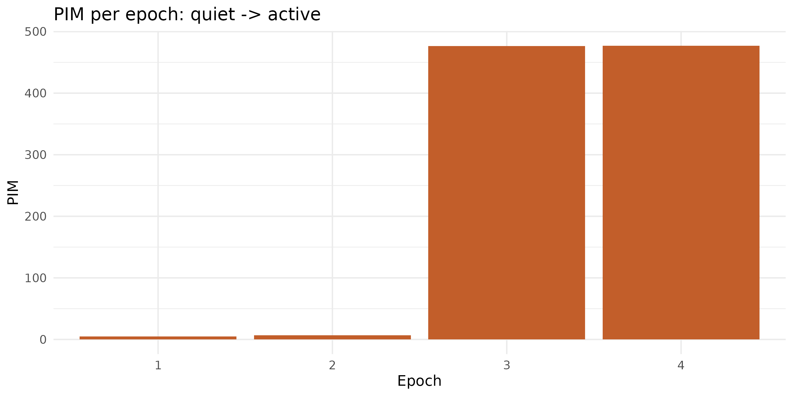

# From raw accelerometry to PIM/TAT/ZCM activity counts

[`read_acttrust()`](https://zeitr.circadia-lab.uk/reference/read_acttrust.md)
reads the PIM/TAT/ZCM counts an ActTrust device already computed
onboard. But some devices and pipelines only ever hand you raw triaxial
acceleration – a GT3X+ raw export, a research-grade IMU, a signal you’ve
captured yourself.
[`compute_activity_counts()`](https://zeitr.circadia-lab.uk/reference/compute_activity_counts.md)
bridges that gap: raw `x`/`y`/`z` samples in, epoch-level PIM/TAT/ZCM
counts out, ready for
[`estimate_ee()`](#from-counts-to-pa-intensity)/[`classify_pa_counts()`](#from-counts-to-pa-intensity)
the same way
[`read_acttrust()`](https://zeitr.circadia-lab.uk/reference/read_acttrust.md)’s
output already is.

**Read
[`?compute_activity_counts`](https://zeitr.circadia-lab.uk/reference/compute_activity_counts.md)
before using this on real data.** Unlike most of zeitR, this isn’t a
validated port of a reference implementation – there is nothing to
validate it against (Condor’s and ActiGraph’s onboard firmware is
proprietary). The help page is explicit about what’s borrowed from a
validated source (the band-pass filter, via mrpheus) and what isn’t (the
PIM/TAT/ZCM aggregation logic itself). **Prefer device-computed counts
whenever they’re available** – reach for this function only when raw
samples are genuinely all you have.

------------------------------------------------------------------------

## The processing chain

1.  Each axis has its DC offset removed
    ([`mrpheus::remove_dc()`](https://circadia-bio.r-universe.dev/mrpheus))
    – important for whichever axis is carrying gravity, typically ~1 g –
    then is band-pass filtered zero-phase
    ([`mrpheus::bandpass_filter()`](https://circadia-bio.r-universe.dev/mrpheus)).
    Both are the same filter primitives already validated as part of
    mrpheus’s YASA-parity PSG pipeline, reused here rather than
    reimplemented.
2.  A vector norm is computed per sample from the *filtered* axes:
    `sqrt(x^2 + y^2 + z^2)` – filter first, then combine, matching the
    order Batista et al. (2026) describe for ActTrust.
3.  Samples are grouped into non-overlapping epochs
    (`epoch_sec * sampling_rate` samples each).
4.  Per epoch: **PIM** (sum of the absolute filtered norm), **TAT**
    (seconds above `tat_threshold`), and **ZCM** (sign changes beyond a
    `zcm_threshold` dead-band, summed across the three axes).

------------------------------------------------------------------------

## A synthetic recording

There’s no bundled raw-accelerometer dataset in zeitR (`inst/extdata`’s
ActTrust file is already epoch-level, same as everything
[`read_acttrust()`](https://zeitr.circadia-lab.uk/reference/read_acttrust.md)
produces) – so this vignette simulates one: 2 minutes of near-still
noise, followed by 2 minutes of clear 1 Hz movement, at a GT3X+-like 25
Hz.

``` r

sr        <- 25   # Hz
epoch_sec <- 60
n         <- sr * epoch_sec * 4  # 4 epochs total
t         <- seq(0, (n - 1) / sr, by = 1 / sr)

set.seed(42)
quiet  <- rnorm(sr * epoch_sec * 2, sd = 0.001)
active <- sin(2 * pi * 1 * t[(sr * epoch_sec * 2 + 1):n]) * 0.5

x <- c(quiet, active)               # all simulated movement on the x-axis
y <- rep(0, n)
z <- rnorm(n, sd = 0.01) + 1         # ~1 g gravity offset, small sensor noise
```

``` r

counts <- compute_activity_counts(x, y, z, sampling_rate = sr, epoch_sec = epoch_sec)
counts
#> # A tibble: 4 × 4
#>   epoch    PIM   TAT   ZCM
#>   <int>  <dbl> <dbl> <dbl>
#> 1     1   4.91  0        8
#> 2     2   6.65  0.52     6
#> 3     3 477.   57.5    127
#> 4     4 477.   57.6    123
```

The first two (quiet) epochs stay near zero on every metric; the last
two (active) epochs show clear PIM, TAT, and ZCM elevation – the
sinusoid crosses zero roughly twice per second, so ~120 crossings/epoch
on the active x-axis is the expected order of magnitude.

``` r

ggplot(counts, aes(x = factor(epoch), y = PIM)) +
  geom_col(fill = "#C25E2A") +
  labs(x = "Epoch", y = "PIM", title = "PIM per epoch: quiet -> active") +
  theme_minimal(base_size = 12)
```



------------------------------------------------------------------------

## GT3X+-style filtering instead of ActTrust-style

`filter_low`/`filter_high` default to `0.5`/`2.7` Hz (ActTrust-style,
per Batista et al. 2026). Swap in `0.25`/`2.5` Hz for GT3X+-style
processing – there’s no separate code path, just different arguments:

``` r

counts_gt3x <- compute_activity_counts(
  x, y, z,
  sampling_rate = sr, epoch_sec = epoch_sec,
  filter_low = 0.25, filter_high = 2.5
)
counts_gt3x
#> # A tibble: 4 × 4
#>   epoch    PIM   TAT   ZCM
#>   <int>  <dbl> <dbl> <dbl>
#> 1     1   5.00  0        4
#> 2     2   6.36  0.16     5
#> 3     3 477.   57.6    125
#> 4     4 477.   57.5    121
```

------------------------------------------------------------------------

## From counts to PA intensity

The whole point of matching
[`read_acttrust()`](https://zeitr.circadia-lab.uk/reference/read_acttrust.md)’s
output shape is that everything downstream stays the same. Feed the
`PIM` column straight into
[`estimate_ee()`](https://zeitr.circadia-lab.uk/reference/estimate_ee.md)/[`classify_pa_counts()`](https://zeitr.circadia-lab.uk/reference/classify_pa_counts.md)
exactly as you would with device-computed counts (see
[`vignette("physical-activity")`](https://zeitr.circadia-lab.uk/articles/physical-activity.md)
for the full discussion and caveats of that step):

``` r

counts$mets         <- estimate_ee(counts$PIM, device = "ACTT", placement = "wrist")
counts$pa_intensity <- classify_pa_intensity(counts$mets)
counts
#> # A tibble: 4 × 6
#>   epoch    PIM   TAT   ZCM  mets pa_intensity
#>   <int>  <dbl> <dbl> <dbl> <dbl> <ord>       
#> 1     1   4.91  0        8  1.56 light       
#> 2     2   6.65  0.52     6  1.57 light       
#> 3     3 477.   57.5    127  1.99 light       
#> 4     4 477.   57.6    123  1.99 light
```

------------------------------------------------------------------------

## Tuning `zcm_threshold` / `tat_threshold`

Both default to small, physically motivated values (`0.01`, `0.05`)
rather than a calibrated constant – there is no published reference
value to default to. If your sensor’s noise floor sits close to either
threshold, you’ll see it directly: a noisy “quiet” epoch registering
non-zero ZCM/TAT is a sign the threshold needs raising for your specific
hardware, not that the function is broken.

``` r

noisy_quiet <- rnorm(sr * epoch_sec, sd = 0.02)  # noisier than the earlier "quiet" segment
compute_activity_counts(
  noisy_quiet, rep(0, length(noisy_quiet)), rep(0, length(noisy_quiet)),
  sampling_rate = sr, epoch_sec = epoch_sec
)
#> # A tibble: 1 × 4
#>   epoch   PIM   TAT   ZCM
#>   <int> <dbl> <dbl> <dbl>
#> 1     1  9.90     0    89
```

------------------------------------------------------------------------

## Next steps

- [`?compute_activity_counts`](https://zeitr.circadia-lab.uk/reference/compute_activity_counts.md)
  – full argument reference and the what-this-is-and-isn’t discussion
- [`?mrpheus::bandpass_filter`](https://mrpheus.circadia-lab.uk/reference/bandpass_filter.html),
  [`?mrpheus::remove_dc`](https://mrpheus.circadia-lab.uk/reference/remove_dc.html)
  – the underlying filter primitives
- [`vignette("physical-activity")`](https://zeitr.circadia-lab.uk/articles/physical-activity.md)
  – what happens after you have PIM counts, and the generalisability
  caveats of the equations that consume them
