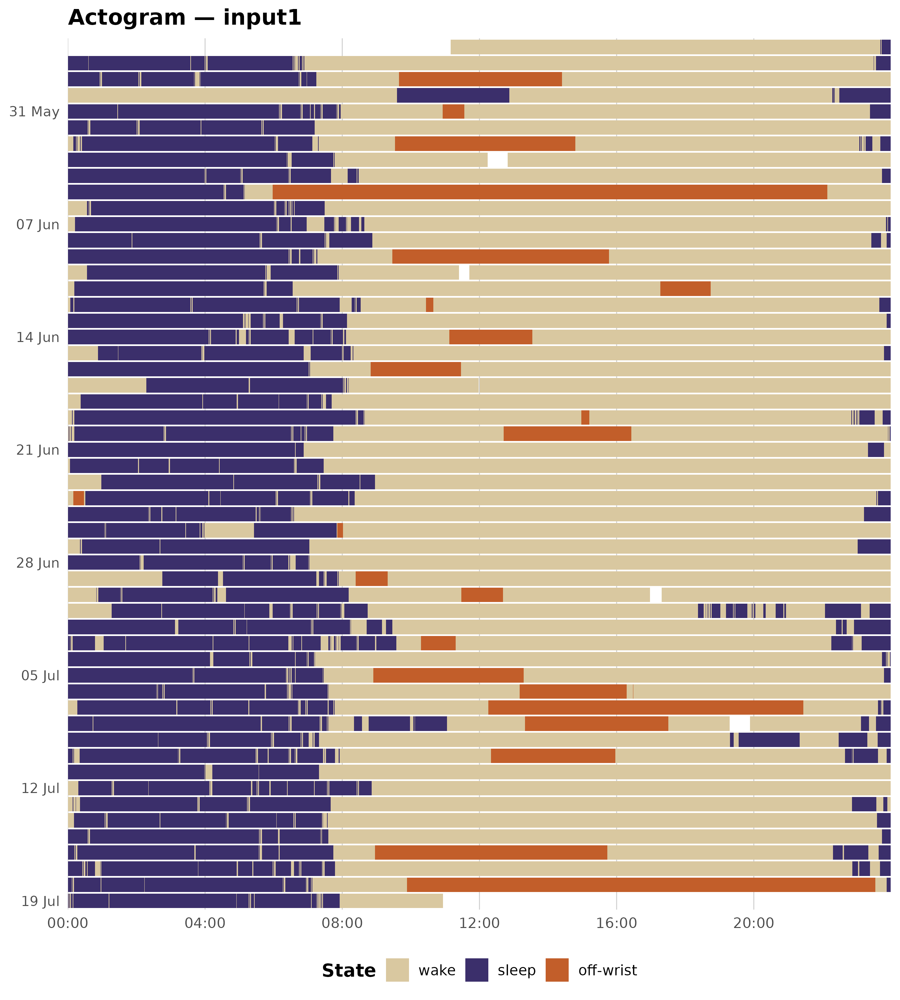

# Single-recording sleep analysis

This vignette walks through a complete single-recording analysis using
the ActTrust validation recording bundled with zeitR. It covers:

1.  Reading the recording
2.  Running the full pipeline
3.  Inspecting nightly sleep statistics
4.  Plotting an actogram
5.  Computing circadian rhythm variables (NPCRA)

------------------------------------------------------------------------

## 1. Read the recording

[`read_acttrust()`](https://zeitr.circadia-lab.uk/reference/read_acttrust.md)
parses the raw ActTrust file and returns a `zeitr_recording` with two
slots: `$epochs` (epoch-level tibble) and `$metadata` (device and
subject information from the file header).

``` r

FILE <- system.file("extdata", "input1.txt", package = "zeitR")
TZ   <- "America/Sao_Paulo"

rec <- read_acttrust(FILE, tz = TZ)
rec
#> # A tibble: 76,196 × 8
#>    datetime            activity int_temp ext_temp      ZCMn state offwrist sleep
#>    <dttm>                 <dbl>    <dbl>    <dbl>     <dbl> <dbl>    <dbl> <dbl>
#>  1 2021-05-27 11:10:15     4856     24.2     23.9   6.35e-8     0        0     0
#>  2 2021-05-27 11:11:15     4483     24.4     24.1   1.5 e+0     0        0     0
#>  3 2021-05-27 11:12:15      425     24.4     23.9   5   e-2     0        0     0
#>  4 2021-05-27 11:13:15      873     24.4     23.9   2.67e-1     0        0     0
#>  5 2021-05-27 11:14:15      413     24.4     23.8   1.67e-2     0        0     0
#>  6 2021-05-27 11:15:15      388     24.4     23.8   8.33e-2     0        0     0
#>  7 2021-05-27 11:16:15      561     24.3     23.8   1.17e-1     0        0     0
#>  8 2021-05-27 11:17:15      447     24.3     23.7   5   e-2     0        0     0
#>  9 2021-05-27 11:18:15      196     24.2     23.6   0           0        0     0
#> 10 2021-05-27 11:19:15      192     24.2     23.6   1.67e-2     0        0     0
#> # ℹ 76,186 more rows
```

The recording spans 52 days at 1-minute epochs — a typical ambulatory
study length.

------------------------------------------------------------------------

## 2. Run the full pipeline

[`run_pipeline()`](https://zeitr.circadia-lab.uk/reference/run_pipeline.md)
chains all analysis steps in sequence:

1.  Timestamp consistency check
2.  Prepare (temperature clamping, state column initialisation)
3.  Off-wrist detection (Condor bimodal algorithm)
4.  Main sleep period detection (Crespo, 2012)
5.  Nap detection (Crespo, 2012)
6.  WASO scoring (Cole-Kripke, 1992)

``` r

result <- run_pipeline(FILE, tz = TZ, quiet = TRUE)
#> ℹ Reading input1.txt ...
#> ✔ [input1] Done. 55 night(s) detected.
result
#> 
#> ── zeitr_result: input1 ────────────────────────────────────────────────────────
#> • Source: /home/runner/work/_temp/Library/zeitR/extdata/input1.txt
#> • Epochs: 76196
#> • Nights: 55
#> • Issues: 5
```

------------------------------------------------------------------------

## 3. Nightly sleep statistics

`result$nights` contains one row per detected sleep period (main nights
and naps). Epoch counts are in minutes for a 1-minute epoch device.

``` r

result$nights |>
  mutate(
    bed_time    = format(bed_time,    "%Y-%m-%d %H:%M"),
    get_up_time = format(get_up_time, "%Y-%m-%d %H:%M"),
    tbt_h       = round(tbt  / 60, 1),
    tst_h       = round(tst  / 60, 1),
    eff_pct     = round(eff  * 100,  1)
  ) |>
  select(night, is_nap, bed_time, get_up_time, tbt_h, tst_h, waso, sol, eff_pct) |>
  knitr::kable(
    col.names = c("Night", "Nap?", "Bed time", "Get-up time",
                  "TBT (h)", "TST (h)", "WASO (min)", "SOL (min)", "Eff (%)"),
    align = "clllrrrrr"
  )
```

| Night | Nap? | Bed time | Get-up time | TBT (h) | TST (h) | WASO (min) | SOL (min) | Eff (%) |
|:--:|:---|:---|:---|---:|---:|---:|---:|---:|
| 1 | FALSE | 2021-05-27 23:42 | 2021-05-28 06:54 | 7.2 | 6.9 | 18 | 0 | 95.8 |
| 2 | FALSE | 2021-05-28 23:30 | 2021-05-29 07:16 | 7.8 | 7.3 | 25 | 0 | 94.4 |
| 3 | FALSE | 2021-05-30 09:28 | 2021-05-30 12:58 | 3.5 | 3.3 | 0 | 8 | 93.8 |
| 4 | FALSE | 2021-05-30 22:18 | 2021-05-31 07:58 | 9.7 | 9.2 | 27 | 0 | 95.3 |
| 5 | FALSE | 2021-05-31 23:24 | 2021-06-01 07:14 | 7.8 | 7.6 | 12 | 0 | 97.0 |
| 6 | FALSE | 2021-06-02 00:10 | 2021-06-02 07:19 | 7.2 | 6.8 | 23 | 0 | 94.6 |
| 7 | FALSE | 2021-06-02 23:05 | 2021-06-03 07:47 | 8.7 | 8.2 | 30 | 0 | 94.3 |
| 8 | FALSE | 2021-06-04 00:01 | 2021-06-04 08:29 | 8.5 | 7.8 | 39 | 0 | 92.3 |
| 9 | FALSE | 2021-06-04 23:36 | 2021-06-05 05:20 | 5.7 | 5.3 | 4 | 9 | 93.3 |
| 10 | FALSE | 2021-06-06 00:34 | 2021-06-06 07:30 | 6.9 | 6.7 | 15 | 0 | 96.4 |
| 11 | FALSE | 2021-06-07 00:13 | 2021-06-07 08:39 | 8.4 | 7.5 | 56 | 0 | 88.9 |
| 12 | FALSE | 2021-06-07 23:52 | 2021-06-08 08:53 | 9.0 | 8.8 | 12 | 0 | 97.8 |
| 13 | FALSE | 2021-06-08 23:26 | 2021-06-09 07:17 | 7.8 | 7.5 | 21 | 0 | 95.5 |
| 14 | FALSE | 2021-06-10 00:25 | 2021-06-10 07:55 | 7.5 | 7.2 | 9 | 9 | 95.8 |
| 15 | FALSE | 2021-06-11 00:12 | 2021-06-11 06:34 | 6.4 | 6.3 | 4 | 0 | 99.0 |
| 16 | FALSE | 2021-06-12 00:05 | 2021-06-12 08:33 | 8.5 | 7.9 | 32 | 0 | 93.7 |
| 17 | FALSE | 2021-06-12 23:40 | 2021-06-13 08:10 | 8.5 | 8.1 | 23 | 0 | 95.3 |
| 18 | FALSE | 2021-06-13 23:53 | 2021-06-14 08:07 | 8.2 | 7.6 | 36 | 0 | 92.7 |
| 19 | FALSE | 2021-06-15 00:53 | 2021-06-15 08:20 | 7.4 | 7.1 | 23 | 0 | 94.9 |
| 20 | FALSE | 2021-06-15 23:48 | 2021-06-16 07:09 | 7.3 | 7.2 | 1 | 0 | 98.6 |
| 21 | FALSE | 2021-06-17 02:18 | 2021-06-17 08:14 | 5.9 | 5.8 | 8 | 0 | 97.2 |
| 22 | FALSE | 2021-06-18 00:23 | 2021-06-18 07:42 | 7.3 | 7.1 | 14 | 0 | 96.8 |
| 23 | FALSE | 2021-06-19 00:07 | 2021-06-19 08:42 | 8.6 | 8.4 | 7 | 1 | 98.1 |
| 24 | FALSE | 2021-06-19 22:50 | 2021-06-20 07:45 | 8.9 | 8.2 | 42 | 1 | 92.0 |
| 25 | FALSE | 2021-06-20 23:55 | 2021-06-21 06:56 | 7.0 | 6.9 | 3 | 0 | 98.6 |
| 26 | FALSE | 2021-06-21 23:20 | 2021-06-22 07:35 | 8.2 | 7.7 | 25 | 0 | 93.5 |
| 27 | FALSE | 2021-06-23 00:59 | 2021-06-23 09:04 | 8.1 | 7.9 | 6 | 0 | 97.5 |
| 28 | FALSE | 2021-06-24 00:31 | 2021-06-24 08:22 | 7.8 | 7.7 | 11 | 0 | 97.7 |
| 29 | FALSE | 2021-06-24 23:35 | 2021-06-25 06:36 | 7.0 | 6.8 | 15 | 0 | 96.4 |
| 30 | FALSE | 2021-06-25 23:13 | 2021-06-26 07:51 | 8.6 | 7.1 | 93 | 0 | 82.0 |
| 31 | FALSE | 2021-06-27 00:22 | 2021-06-27 07:03 | 6.7 | 6.6 | 3 | 0 | 99.3 |
| 32 | FALSE | 2021-06-27 23:02 | 2021-06-28 07:03 | 8.0 | 7.6 | 25 | 0 | 94.8 |
| 33 | FALSE | 2021-06-29 02:46 | 2021-06-29 08:00 | 5.2 | 4.8 | 19 | 0 | 92.0 |
| 34 | FALSE | 2021-06-30 00:50 | 2021-06-30 08:13 | 7.4 | 7.0 | 25 | 0 | 94.1 |
| 35 | FALSE | 2021-07-01 01:17 | 2021-07-01 08:45 | 7.5 | 7.1 | 21 | 0 | 95.3 |
| 36 | FALSE | 2021-07-01 18:23 | 2021-07-01 20:57 | 2.6 | 1.4 | 67 | 0 | 56.5 |
| 37 | FALSE | 2021-07-01 22:05 | 2021-07-02 09:28 | 11.4 | 10.3 | 63 | 0 | 90.8 |
| 38 | FALSE | 2021-07-02 22:24 | 2021-07-03 09:35 | 11.2 | 9.9 | 76 | 0 | 88.7 |
| 39 | FALSE | 2021-07-03 22:16 | 2021-07-04 07:14 | 9.0 | 8.4 | 31 | 0 | 94.1 |
| 40 | FALSE | 2021-07-04 23:45 | 2021-07-05 07:32 | 7.8 | 7.4 | 18 | 0 | 95.3 |
| 41 | FALSE | 2021-07-05 23:48 | 2021-07-06 07:40 | 7.9 | 7.6 | 15 | 0 | 96.2 |
| 42 | FALSE | 2021-07-07 00:17 | 2021-07-07 07:48 | 7.5 | 7.2 | 17 | 0 | 96.0 |
| 43 | FALSE | 2021-07-07 23:38 | 2021-07-08 11:04 | 11.4 | 10.1 | 78 | 0 | 88.6 |
| 44 | FALSE | 2021-07-08 23:08 | 2021-07-09 07:20 | 8.2 | 7.7 | 33 | 0 | 93.3 |
| 45 | FALSE | 2021-07-09 19:19 | 2021-07-09 21:23 | 2.1 | 1.9 | 9 | 0 | 91.1 |
| 46 | FALSE | 2021-07-09 22:29 | 2021-07-10 07:56 | 9.4 | 8.5 | 55 | 0 | 90.3 |
| 47 | FALSE | 2021-07-10 22:40 | 2021-07-11 07:20 | 8.7 | 8.2 | 31 | 0 | 94.0 |
| 48 | FALSE | 2021-07-12 00:19 | 2021-07-12 08:52 | 8.6 | 8.2 | 23 | 0 | 95.5 |
| 49 | FALSE | 2021-07-13 00:09 | 2021-07-13 07:40 | 7.5 | 7.2 | 18 | 0 | 96.0 |
| 50 | FALSE | 2021-07-13 22:52 | 2021-07-14 07:35 | 8.7 | 7.9 | 50 | 0 | 90.4 |
| 51 | FALSE | 2021-07-14 23:36 | 2021-07-15 07:40 | 8.1 | 7.8 | 12 | 0 | 96.7 |
| 52 | FALSE | 2021-07-15 23:45 | 2021-07-16 07:45 | 8.0 | 7.8 | 13 | 0 | 97.3 |
| 53 | FALSE | 2021-07-16 22:19 | 2021-07-17 07:48 | 9.5 | 8.6 | 56 | 0 | 90.2 |
| 54 | FALSE | 2021-07-17 22:53 | 2021-07-18 07:28 | 8.6 | 7.7 | 32 | 0 | 89.9 |
| 55 | FALSE | 2021-07-18 23:53 | 2021-07-19 07:57 | 8.1 | 7.7 | 19 | 0 | 95.9 |

Key sleep variables:

| Variable | Definition                                                  |
|----------|-------------------------------------------------------------|
| **TBT**  | Total Bed Time — duration from lights-out to get-up         |
| **TST**  | Total Sleep Time — TBT minus WASO and SOL                   |
| **WASO** | Wake After Sleep Onset — wake epochs after first sleep      |
| **SOL**  | Sleep Onset Latency — epochs from lights-out to first sleep |
| **Eff**  | Sleep efficiency — TST / TBT                                |

### Timestamp issues

``` r

if (nrow(result$issues) == 0L) {
  cat("No timestamp issues detected.\n")
} else {
  knitr::kable(result$issues)
}
```

|   row | datetime            | issue | detail                       |
|------:|:--------------------|:------|:-----------------------------|
| 10146 | 2021-06-03 12:50:54 | gap   | 2199 s gap before this epoch |
| 20141 | 2021-06-10 11:43:44 | gap   | 1130 s gap before this epoch |
| 30237 | 2021-06-17 12:01:57 | gap   | 193 s gap before this epoch  |
| 49255 | 2021-06-30 17:19:12 | gap   | 1215 s gap before this epoch |
| 60894 | 2021-07-08 19:54:25 | gap   | 2233 s gap before this epoch |

------------------------------------------------------------------------

## 4. Actogram

An actogram displays the full epoch-level state sequence as a raster,
with one row per day and time-of-day on the x-axis. It is the standard
visual summary for actigraphy data.

``` r

state_colours <- c(
  "wake"      = "#D9C8A0",
  "sleep"     = "#3B2F6B",
  "off-wrist" = "#C25E2A"
)

d <- result$data |>
  mutate(
    state_label         = label_states(state),
    date                = as.Date(datetime, tz = TZ),
    mins_since_midnight = as.integer(format(datetime, "%H")) * 60L +
                          as.integer(format(datetime, "%M"))
  )

ggplot(d, aes(x = mins_since_midnight,
              y = forcats::fct_rev(factor(date)),
              fill = state_label)) +
  geom_tile(height = 0.9, width = 1) +
  scale_fill_manual(values = state_colours, name = "State", drop = TRUE) +
  scale_x_continuous(
    breaks = seq(0, 23 * 60, 4 * 60),
    labels = function(x) sprintf("%02d:00", x %/% 60L),
    expand = c(0, 0),
    limits = c(0, 24 * 60)
  ) +
  scale_y_discrete(
    breaks = function(x) x[seq(1, length(x), by = 7)],
    labels = function(x) format(as.Date(x), "%d %b"),
    expand = c(0.01, 0.01)
  ) +
  labs(x = NULL, y = NULL, title = paste0("Actogram \u2014 ", result$subject_id)) +
  theme_minimal(base_size = 13) +
  theme(
    panel.grid.major.x = element_line(colour = "grey80", linewidth = 0.3),
    panel.grid.minor.x = element_blank(),
    panel.grid.major.y = element_blank(),
    legend.position    = "bottom",
    legend.title       = element_text(face = "bold"),
    plot.title         = element_text(face = "bold"),
    axis.text.y        = element_text(size = 10)
  )
#> Warning: Removed 53 rows containing missing values or values outside the scale range
#> (`geom_tile()`).
```



The recording shows a consistent nocturnal sleep pattern (dark purple
bands centred around midnight) with a brief off-wrist episode visible in
the first week.

------------------------------------------------------------------------

## 5. Circadian rhythm analysis (NPCRA)

[`compute_npcra()`](https://zeitr.circadia-lab.uk/reference/compute_npcra.md)
derives the standard non-parametric circadian rhythm variables from the
raw activity time series.

``` r

npcra <- compute_npcra(rec)

npcra |>
  select(-participant_id) |>
  mutate(across(everything(), as.character)) |>
  tidyr::pivot_longer(everything(), names_to = "Variable", values_to = "Value") |>
  mutate(Description = c(
    "Interdaily stability (0\u20131; higher = more consistent rhythm)",
    "Intradaily variability (\u22650; higher = more fragmented rhythm)",
    "Relative amplitude (0\u20131; contrast between M10 and L5)",
    "Mean activity during the least-active 5 h window",
    "Clock time of the L5 window onset (hh:mm)",
    "Mean activity during the most-active 10 h window",
    "Clock time of the M10 window onset (hh:mm)",
    "Recording duration in days",
    "Total number of epochs"
  )) |>
  knitr::kable(col.names = c("Variable", "Value", "Description"),
               align = "lrl")
```

| Variable | Value | Description |
|:---|---:|:---|
| IS | 0.2156 | Interdaily stability (0–1; higher = more consistent rhythm) |
| IV | 0.9994 | Intradaily variability (≥0; higher = more fragmented rhythm) |
| RA | 0.9411 | Relative amplitude (0–1; contrast between M10 and L5) |
| L5 | 116.4156 | Mean activity during the least-active 5 h window |
| L5_onset | 01:00 | Clock time of the L5 window onset (hh:mm) |
| M10 | 3837.8615 | Mean activity during the most-active 10 h window |
| M10_onset | 08:00 | Clock time of the M10 window onset (hh:mm) |
| n_days | 52.91 | Recording duration in days |
| n_epochs | 76196 | Total number of epochs |

For a healthy adult with a regular sleep-wake schedule you would expect:

- **IS** \> 0.6 (consistent 24 h rhythm)
- **IV** \< 1.0 (low fragmentation)
- **RA** \> 0.8 (high contrast between rest and activity)
- **L5 onset** around 01:00–04:00 (nocturnal rest trough)
- **M10 onset** around 08:00–12:00 (morning activity peak)

------------------------------------------------------------------------

## Next steps

- [`vignette("study-analysis")`](https://zeitr.circadia-lab.uk/articles/study-analysis.md)
  — batch processing across multiple participants
- [`vignette("npcra")`](https://zeitr.circadia-lab.uk/articles/npcra.md)
  — NPCRA variable definitions and interpretation
- [`?run_pipeline`](https://zeitr.circadia-lab.uk/reference/run_pipeline.md)
  — full pipeline parameter reference
- [`?acttrust_params`](https://zeitr.circadia-lab.uk/reference/acttrust_params.md)
  — default algorithm parameters for the ActTrust device
