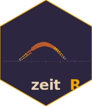

# zeitR 

**Actigraphy data parsing and analysis for R.**

[](https://zeitr.circadia-lab.uk/LICENSE)
[](https://www.r-project.org/)
[](https://github.com/circadia-bio/zeitR/actions/workflows/R-CMD-check.yaml)
[](https://github.com/circadia-bio/zeitR)
[](https://zeitr.circadia-lab.uk)

------------------------------------------------------------------------

> \[!WARNING\] **zeitR is in early development and has not been formally
> tested.** The API may change without notice, computed variables have
> not yet been validated against reference implementations, and the
> package has not undergone peer review. Use with caution and verify
> outputs independently before using in any research context.

------------------------------------------------------------------------

## 📖 What is zeitR?

zeitR is an R package for importing, parsing, and analysing raw
actigraphy recordings. It reads common device output formats, computes
standard non-parametric rest-activity variables (IS, IV, RA, L5, M10),
and assembles tidy data frames ready for downstream chronobiological
analysis.

zeitR is designed to complement
[slumbR](https://github.com/circadia-bio/slumbR) in the Circadia Lab
ecosystem: slumbR handles sleep diary and questionnaire data, zeitR
handles the actigraphy side of a study, and both packages speak the same
tidy, pipeline-friendly R idioms.

------------------------------------------------------------------------

## ✨ Features

- 📥
  **[`read_actigraphy()`](https://zeitr.circadia-lab.uk/reference/read_actigraphy.md)**
  — parse a single actigraphy file into a structured `zeitr_recording`
  object
- 📂
  **[`read_actigraphy_dir()`](https://zeitr.circadia-lab.uk/reference/read_actigraphy_dir.md)**
  — batch-read a whole directory of files into a `zeitr_study`
- 📐
  **[`compute_npcra()`](https://zeitr.circadia-lab.uk/reference/compute_npcra.md)**
  — non-parametric circadian rhythm analysis: IS, IV, RA, L5, M10
- 🌅 **`compute_rest_activity()`** — derive rest and activity
  onset/offset, total rest time, and fragmentation indices
- 🔀 **`epoch_resample()`** — resample recordings to a target epoch
  length
- 📊
  **[`study_summary()`](https://zeitr.circadia-lab.uk/reference/study_summary.md)**
  — participant-level summary of recording quality and key variables

------------------------------------------------------------------------

## 🗂️ Project Structure

    zeitR/
    ├── R/
    │   ├── zeitR-package.R       # package-level docs and imports
    │   ├── import.R              # read_actigraphy(), read_actigraphy_dir()
    │   ├── compute.R             # compute_npcra(), compute_rest_activity()
    │   ├── resample.R            # epoch_resample()
    │   ├── tidy.R                # study_summary(), print/summary S3 methods
    │   └── utils.R               # internal helpers
    ├── man/figures/
    │   └── logo.svg              # hex sticker
    ├── man/                      # roxygen2-generated documentation
    ├── vignettes/
    │   └── getting-started.Rmd  # end-to-end worked example
    ├── tests/testthat/
    │   └── test-package.R
    ├── .github/workflows/
    │   ├── R-CMD-check.yaml
    │   └── pkgdown.yaml
    ├── DESCRIPTION
    ├── LICENSE
    ├── NEWS.md
    └── zeitR.Rproj

------------------------------------------------------------------------

## 🚀 Getting Started

### Prerequisites

- R ≥ 4.1
- The following packages (installed automatically): `dplyr`, `tidyr`,
  `lubridate`, `purrr`, `rlang`, `cli`

### Installation

``` r

# Install from GitHub (requires remotes)
remotes::install_github("circadia-bio/zeitR")
```

### Basic usage

``` r

library(zeitR)

# ── Single recording ────────────────────────────────────────────────────────
rec <- read_actigraphy("recordings/P001.csv")

rec$epochs      # tidy epoch-level data frame (timestamp, activity, ...)
rec$metadata    # device info, epoch length, recording window

# ── Non-parametric circadian rhythm analysis ────────────────────────────────
npcra <- compute_npcra(rec)
npcra
#>   participant_id    IS    IV    RA    L5  M10
#>            P001  0.72  0.43  0.89  12.3  84.7

# ── Whole study ─────────────────────────────────────────────────────────────
study <- read_actigraphy_dir("recordings/")
study_summary(study)
#>   participant_id n_days mean_IS mean_IV mean_RA ...
```

------------------------------------------------------------------------

## 📐 Computed variables

[`compute_npcra()`](https://zeitr.circadia-lab.uk/reference/compute_npcra.md)
returns the standard non-parametric circadian rhythm analysis variables:

| Variable | Definition |
|----|----|
| `IS` | Interdaily stability — consistency of the 24 h rhythm across days (0–1) |
| `IV` | Intradaily variability — fragmentation of the rest-activity rhythm (≥ 0) |
| `RA` | Relative amplitude — contrast between the most active and least active periods (0–1) |
| `L5` | Mean activity during the least active 5 h window |
| `M10` | Mean activity during the most active 10 h window |
| `L5_onset` | Clock time of L5 |
| `M10_onset` | Clock time of M10 |

All variables follow the definitions in Van Someren et al. (1999) and
Marler et al. (2006).

------------------------------------------------------------------------

## 📦 Dependencies

| Package   | Version | Purpose                      |
|-----------|---------|------------------------------|
| dplyr     | ≥ 1.1.0 | Data manipulation            |
| tidyr     | ≥ 1.3.0 | Pivoting and reshaping       |
| lubridate | ≥ 1.9.0 | Date/time handling           |
| purrr     | ≥ 1.0.0 | Functional iteration         |
| rlang     | ≥ 1.1.0 | Error/warning infrastructure |
| cli       | ≥ 3.6.0 | Progress and messages        |

------------------------------------------------------------------------

## 👥 Authors

| Role | Name | Affiliation |
|----|----|----|
| Author, maintainer | Lucas França | Northumbria University, Circadia Lab |
| Author | Mario Leocadio-Miguel | Northumbria University, Circadia Lab |

------------------------------------------------------------------------

## 🤝 Related Tools

- 🌙 [**slumbR**](https://github.com/circadia-bio/slumbR) — R companion
  for Sleep Diaries exports (sleep variables, questionnaire scoring)
- 🧮 [**tallieR**](https://github.com/circadia-bio/tallieR) — R
  companion for ScoreMe questionnaire exports
- 🔬 [**circadia-bio**](https://github.com/circadia-bio) — the Circadia
  Lab GitHub organisation

------------------------------------------------------------------------

## 📄 Licence


Released under the [MIT License](https://zeitr.circadia-lab.uk/LICENSE).

Copyright © Lucas França, Mario Leocadio-Miguel, 2026
